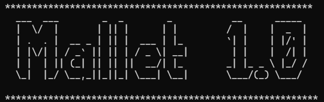
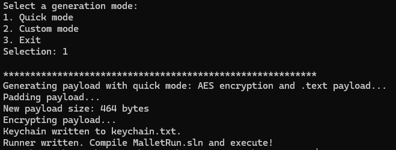

# Mallet
Mallet is a tool to quickly generate shellcode droppers that will evade basic AV solutions like Windows Defender. Mallet supports custom shellcode as well as templates for popular C2 frameworks like Metasploit and Havoc.

## Usage
The tool itself consists of two basic parts - the generator (Mallet) and runner (MalletRun). 

The generator will take a raw shellcode file and encrypt it using either a preset chain or a custom chain specified by the user. The keychain used will be written to a log file and a decryption protocol will be inserted into the runner template.

Place the generator (`Mallet.exe`) in the `MalletRun` directory and use it to generate the runner code. Afterwards, open the `MalletRun.sln` Visual Studio project and compile it to binary for execution.

### Quick Mode
Quick mode can be used to generate a runner payload with default options - a `.text` payload with AES encryption and local thread execution:

Fortunately, Windows Defender is worthless and this will likely be enough for the majority of use cases.

### Custom Mode
Custom mode allows much more control over payload generation parameters. The user may specify a custom encryption chain (limit 10):

Custom payload location:

As well as custom execution methods, including `.dll`:

Finally, you may choose to obfuscate the runner template's strings. This will replace variable names with random strings:

## Disclaimer
Mallet is just a way for me to make quick-and-dirty droppers and learn more about C and the Win32 API. This tool isn't going to save you from an EDR or any competent AV solution.

This tool is only to be used for authorized testing or educational purposes. I do not condone the use of this tool in any criminal or malicious activities.

## To-Do
- Execution methods
- DLL format support
- Msfvenom templates
- Havoc C2 templates

Eventually, I would like to expand Mallet to include auto-compilation as well, but this is a rather large item. We will see...
