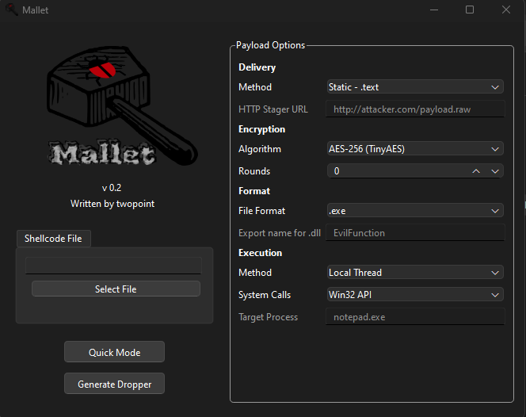

# Mallet
Mallet is a tool to quickly generate shellcode droppers that will evade basic AV solutions like Windows Defender.

MALLET IS A WIP. MANY FEATURES ARE NOT YET IMPLEMENTED.

## Usage
Clone the repo and start `Mallet.bat`. Use the menu to select your settings and generate a payload. The output dropper and keychain will be stored in the Output folder.

### Quick Mode
Quick mode can be used to generate a runner payload with default options - a `.text` payload with a single round of AES encryption and local thread execution. Windows Defender is pretty bad so this is likely all you will need.

## Results

Using quick mode alone yields a somewhat concerning result of only 18 detections out of the 70 top AV solutions according to VirusTotal:

## Troubleshooting

Mallet requires VS version 2022 - specifically the Developer Powershell script for auto-compilation. Mallet also uses Qt for the GUI which may have dependency issues in some cases. Consider installing Qt on your machine if you run into any trouble.

## Disclaimer
Mallet is just a way for me to make quick-and-dirty droppers and learn more about C and the Win32 API. This tool isn't going to save you from an EDR or any competent AV solution, and is currently held together by Elmer's glue and small strips of construction paper.

This tool is only to be used for authorized testing or educational purposes. I do not condone the use of this tool in any criminal or malicious activities.

## To-Do
- Make skeleton files to reduce fprintf calls
- Execution methods will be getting an overhaul eventually (NT API and indirect calls).
- DLL format support
- RC4 and XOR
- Msfvenom templates
- Error handling

